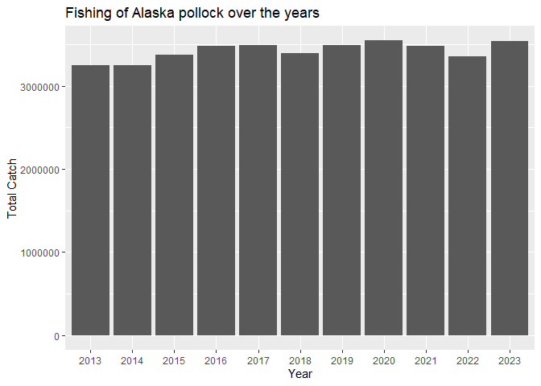
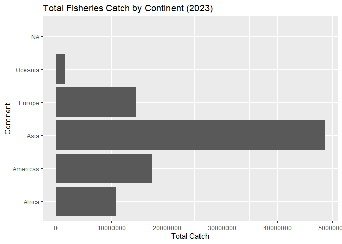

## Instructions
Answer the following questions and/or complete the exercises in RMarkdown. Please embed all of your code and push the final work to your repository. Your report should be organized, clean, and run free from errors. Remember, you must remove the `#` for any included code chunks to run.  

## Load the libraries

``` r
library("tidyverse")
library("janitor")
#library("naniar")
options(scipen = 999)
```

## About the Data
For this assignment we are going to work with a data set from the [United Nations Food and Agriculture Organization](https://www.fao.org/fishery/en/collection/capture) on world fisheries. These data were downloaded and cleaned using the `fisheries_clean.Rmd` script.  

Load the data `fisheries_clean.csv` as a new object titled `fisheries_clean`.

``` r
fisheries_clean <- read_csv("data/fisheries_clean.csv")
```

1. Explore the data. What are the names of the variables, what are the dimensions, are there any NA's, what are the classes of the variables, etc.? You may use the functions that you prefer.

``` r
names(fisheries_clean)
```

```
## [1] "period"          "continent"       "geo_region"      "country"        
## [5] "scientific_name" "common_name"     "taxonomic_code"  "catch"          
## [9] "status"
```

``` r
dim(fisheries_clean)
```

```
## [1] 1055015       9
```

``` r
glimpse(fisheries_clean)
```

```
## Rows: 1,055,015
## Columns: 9
## $ period          <dbl> 1950, 1951, 1952, 1953, 1954, 1955, 1956, 1957, 1958, …
## $ continent       <chr> "Asia", "Asia", "Asia", "Asia", "Asia", "Asia", "Asia"…
## $ geo_region      <chr> "Southern Asia", "Southern Asia", "Southern Asia", "So…
## $ country         <chr> "Afghanistan", "Afghanistan", "Afghanistan", "Afghanis…
## $ scientific_name <chr> "Osteichthyes", "Osteichthyes", "Osteichthyes", "Ostei…
## $ common_name     <chr> "Freshwater fishes NEI", "Freshwater fishes NEI", "Fre…
## $ taxonomic_code  <chr> "1990XXXXXXXX106", "1990XXXXXXXX106", "1990XXXXXXXX106…
## $ catch           <dbl> 100, 100, 100, 100, 100, 200, 200, 200, 200, 200, 200,…
## $ status          <chr> "A", "A", "A", "A", "A", "A", "A", "A", "A", "A", "A",…
```

2. Convert the following variables to factors: `period`, `continent`, `geo_region`, `country`, `scientific_name`, `common_name`, `taxonomic_code`, and `status`.

``` r
fisheries_clean %>% 
  mutate(across(c(period,
           continent,
           geo_region,
           country,
           scientific_name,
           common_name,
           taxonomic_code,
           status),as_factor))
```

```
## # A tibble: 1,055,015 × 9
##    period continent geo_region    country     scientific_name common_name       
##    <fct>  <fct>     <fct>         <fct>       <fct>           <fct>             
##  1 1950   Asia      Southern Asia Afghanistan Osteichthyes    Freshwater fishes…
##  2 1951   Asia      Southern Asia Afghanistan Osteichthyes    Freshwater fishes…
##  3 1952   Asia      Southern Asia Afghanistan Osteichthyes    Freshwater fishes…
##  4 1953   Asia      Southern Asia Afghanistan Osteichthyes    Freshwater fishes…
##  5 1954   Asia      Southern Asia Afghanistan Osteichthyes    Freshwater fishes…
##  6 1955   Asia      Southern Asia Afghanistan Osteichthyes    Freshwater fishes…
##  7 1956   Asia      Southern Asia Afghanistan Osteichthyes    Freshwater fishes…
##  8 1957   Asia      Southern Asia Afghanistan Osteichthyes    Freshwater fishes…
##  9 1958   Asia      Southern Asia Afghanistan Osteichthyes    Freshwater fishes…
## 10 1959   Asia      Southern Asia Afghanistan Osteichthyes    Freshwater fishes…
## # ℹ 1,055,005 more rows
## # ℹ 3 more variables: taxonomic_code <fct>, catch <dbl>, status <fct>
```

3. Are there any missing values in the data? If so, which variables contain missing values and how many are missing for each variable?

``` r
#SKIP
```

4. How many countries are represented in the data?
#249 countries are represented in the data. 


``` r
fisheries_clean %>% 
  select(country) %>% 
  summarize(n_distinct(country))
```

```
## # A tibble: 1 × 1
##   `n_distinct(country)`
##                   <int>
## 1                   249
```

5. The variables `common_name` and `taxonomic_code` both refer to species. How many unique species are represented in the data based on each of these variables? Are the numbers the same or different?

``` r
fisheries_clean %>% 
  summarise(n_distinct(common_name),n_distinct(taxonomic_code))
```

```
## # A tibble: 1 × 2
##   `n_distinct(common_name)` `n_distinct(taxonomic_code)`
##                       <int>                        <int>
## 1                      3390                         3722
```


6. In 2023, what were the top five countries that had the highest overall catch?
#In 2023, the top five countiress with the highest overal catch were China, Indonesia, India, Russian Federation, and the United States of America in that order. 


``` r
fisheries_clean %>% 
  filter(period=="2023") %>% 
  group_by(country) %>% 
  summarize(total_catch=sum(catch,na.rm = T)) %>% 
  arrange(desc(total_catch))%>% 
  slice_head(n=5)
```

```
## # A tibble: 5 × 2
##   country                  total_catch
##   <chr>                          <dbl>
## 1 China                      13424705.
## 2 Indonesia                   7820833.
## 3 India                       6177985.
## 4 Russian Federation          5398032 
## 5 United States of America    4623694
```

``` r
#Group by country
#barPLot?
```

7. In 2023, what were the top 10 most caught species? To keep things simple, assume `common_name` is sufficient to identify species. What does `NEI` stand for in some of the common names? How might this be concerning from a fisheries management perspective?
#The top ten most caught species in 2023 were Marine fishes, Freshwater fishes, Alaska Pollock, Skipjack tuna, Anchoveta, Blue Whiting, Pacific Sardine, Yellowfin Tuna, Atlantic Herring, and Scads respectivly. NEI stands for "Not Elsewhere Included", meaning that the fish were grouped with many species together, causing a concerning issue of hiding important fishing data that could show concerns for certain species or lead to the overconsumption of a certain species.


``` r
fisheries_clean %>% 
  filter(period == "2023") %>% 
  group_by(common_name) %>% 
  summarize(total_catch = sum(catch, na.rm = TRUE)) %>% 
  arrange(desc(total_catch)) %>% 
  slice_head(n = 10)
```

```
## # A tibble: 10 × 2
##    common_name                    total_catch
##    <chr>                                <dbl>
##  1 Marine fishes NEI                 8553907.
##  2 Freshwater fishes NEI             5880104.
##  3 Alaska pollock(=Walleye poll.)    3543411.
##  4 Skipjack tuna                     2954736.
##  5 Anchoveta(=Peruvian anchovy)      2415709.
##  6 Blue whiting(=Poutassou)          1739484.
##  7 Pacific sardine                   1678237.
##  8 Yellowfin tuna                    1601369.
##  9 Atlantic herring                  1432807.
## 10 Scads NEI                         1344190.
```

8. For the species that was caught the most above (not NEI), which country had the highest catch in 2023?
#Removing NEI species has the country with the highest catch in 2023 to be the Russian Federation. 


``` r
top_species <- fisheries_clean %>% 
  filter(period == "2023",
         !str_detect(common_name, "NEI")) %>% 
  group_by(common_name) %>% 
  summarize(total_catch = sum(catch, na.rm = TRUE)) %>% 
  arrange(desc(total_catch)) %>% 
  slice_head(n = 1) %>% 
  pull(common_name)
```


``` r
fisheries_clean %>% 
  filter(period == "2023",
         common_name == top_species) %>% 
  group_by(country) %>% 
  summarize(total_catch = sum(catch, na.rm = TRUE)) %>% 
  arrange(desc(total_catch)) %>% 
  slice_head(n = 1)
```

```
## # A tibble: 1 × 2
##   country            total_catch
##   <chr>                    <dbl>
## 1 Russian Federation     1893924
```
9. How has fishing of this species changed over the last decade (2013-2023)? Create a  plot showing total catch by year for this species.
#Over the last decade, the fishing of the Alaska Pollock, while fluctuating, seems to show a pattern of increased fishing over the decade. 


``` r
species_trend <- fisheries_clean %>% 
  filter(common_name == top_species,
         period >= 2013,
         period <= 2023) %>% 
  group_by(period) %>% 
  summarize(total_catch = sum(catch, na.rm = TRUE))
```


``` r
ggplot(species_trend, aes(x = factor(period), y = total_catch)) +
  geom_col() +
  labs(
    title = "Fishing of Alaska pollock over the years",
    x = "Year",
    y = "Total Catch"
  ) 
```

<!-- -->

10. Perform one exploratory analysis of your choice. Make sure to clearly state the question you are asking before writing any code.
#I wish to show how total fisheries catch vary between continents in 2023.

#Based on the graph given, Asia has a vastly higher amount of catch in 2023 compared to the other continents, with Oceania having an extremly low amount. This potentially shows how Asia may be the most suitable place for their harvesting.


``` r
fisheries_clean %>% 
  filter(period == "2023") %>% 
  group_by(continent) %>% 
  summarize(total_catch = sum(catch, na.rm = TRUE)) %>% 
  ggplot(aes(x = continent, y = total_catch)) +
  geom_col() +
  coord_flip() +
  labs(
    title = "Total Fisheries Catch by Continent (2023)",
    x = "Continent",
    y = "Total Catch"
  )
```

<!-- -->


## Knit and Upload
Please knit your work as an .html file and upload to Canvas. Homework is due before the start of the next lab. No late work is accepted. Make sure to use the formatting conventions of RMarkdown to make your report neat and clean!  
